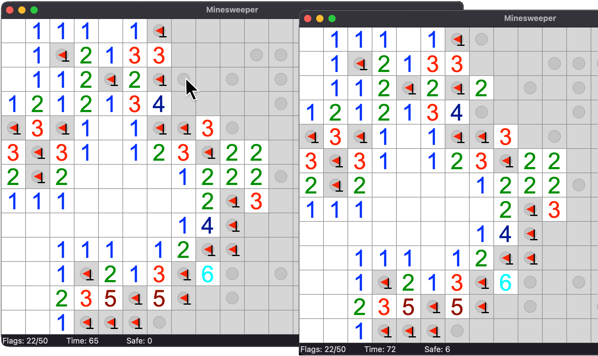

A minesweeper game, but you **always win** if you play perfectly.

Whenever you are forced to make a decision, the game will shift the odds in your favor. If you happen to click on a mine, the game will move it — but only if there are absolutely no safe tiles left for you to discover.

After discovering all safe tiles, if there is a pair of tiles each with a 50% chance of being safe, you must click one of them. If no such pairs are available, you can click any tile adjacent to a discovered tile. If neither option is available, it is safe to click any tile.

(mines are not normally shown while playing, the screenshot is for demonstration purposes)

## Dev mode

- `m` will toggle display the mines on the board
- `c` will click all the "known safe" tiles
- `f` will flag all the "known mines" tiles
- `p` will toggle display the probabilities of each tiles as seen by the program
- `i` will toggle display the tile indexes on the board